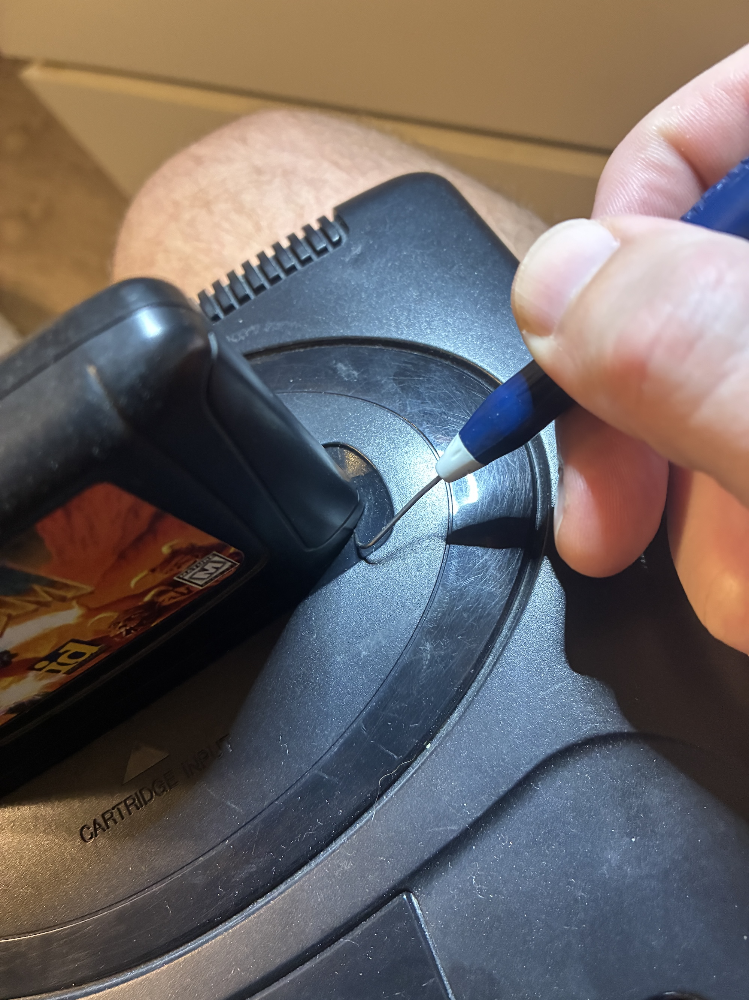
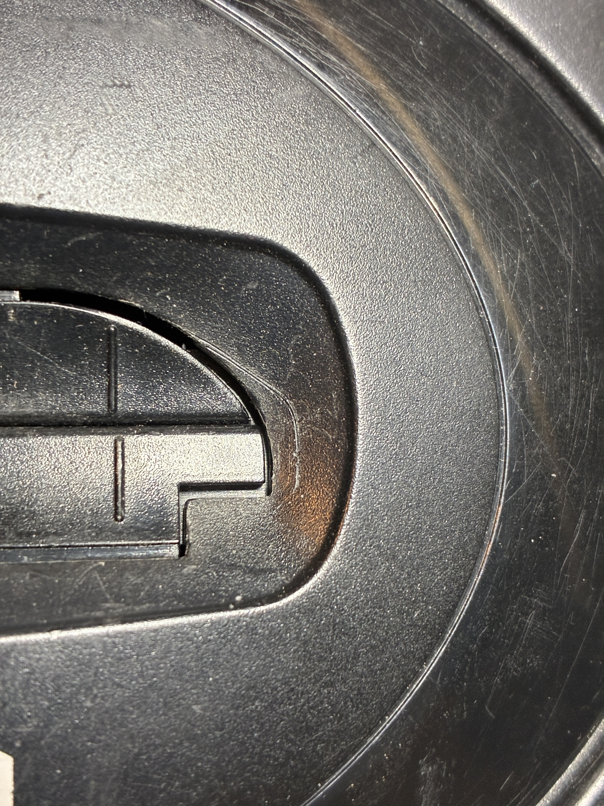
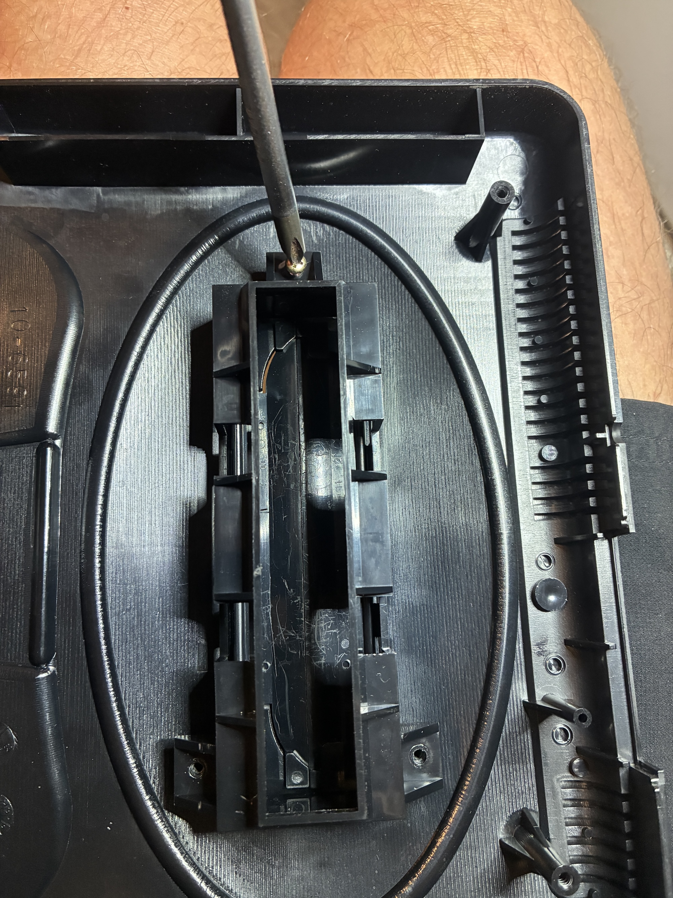
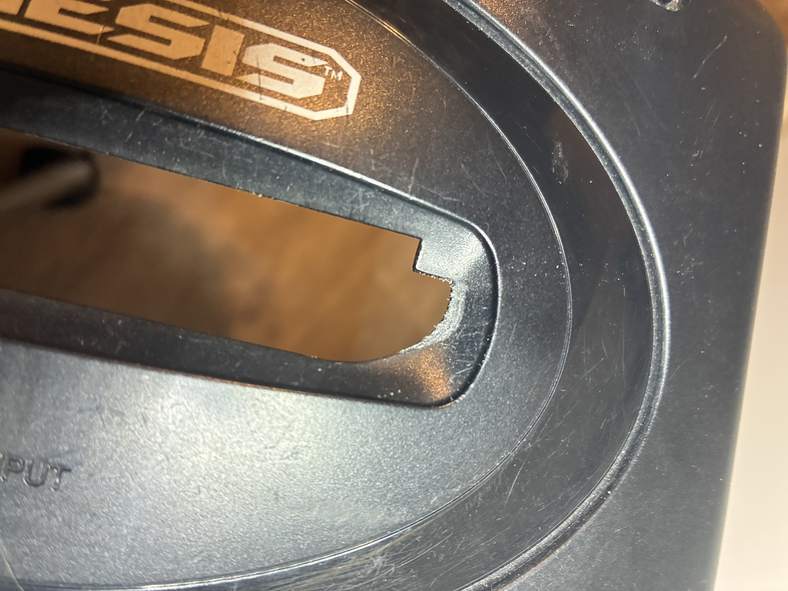
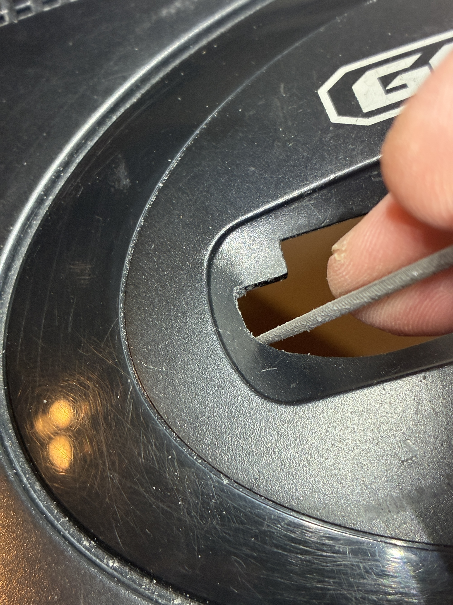
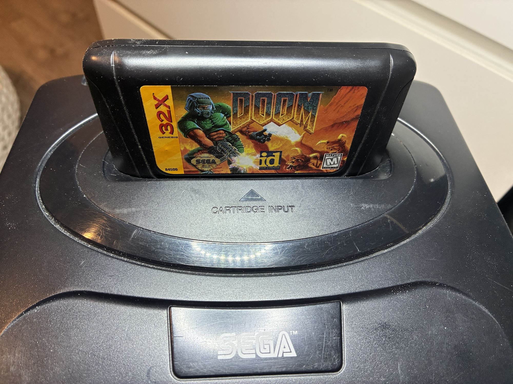
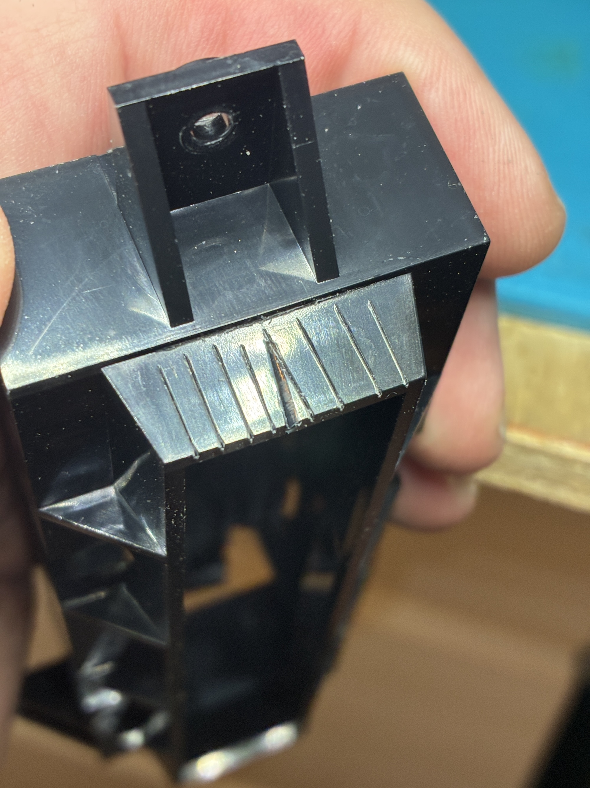
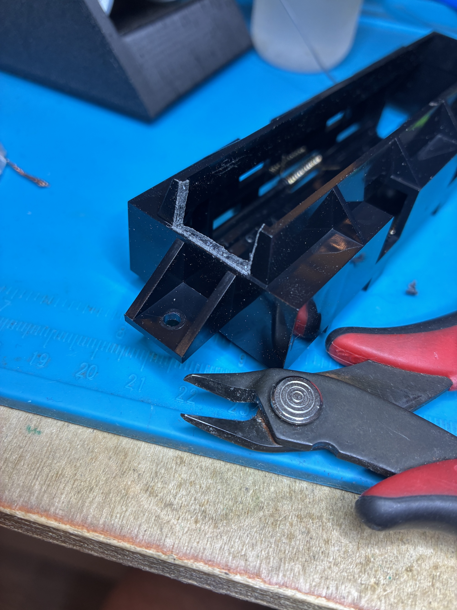
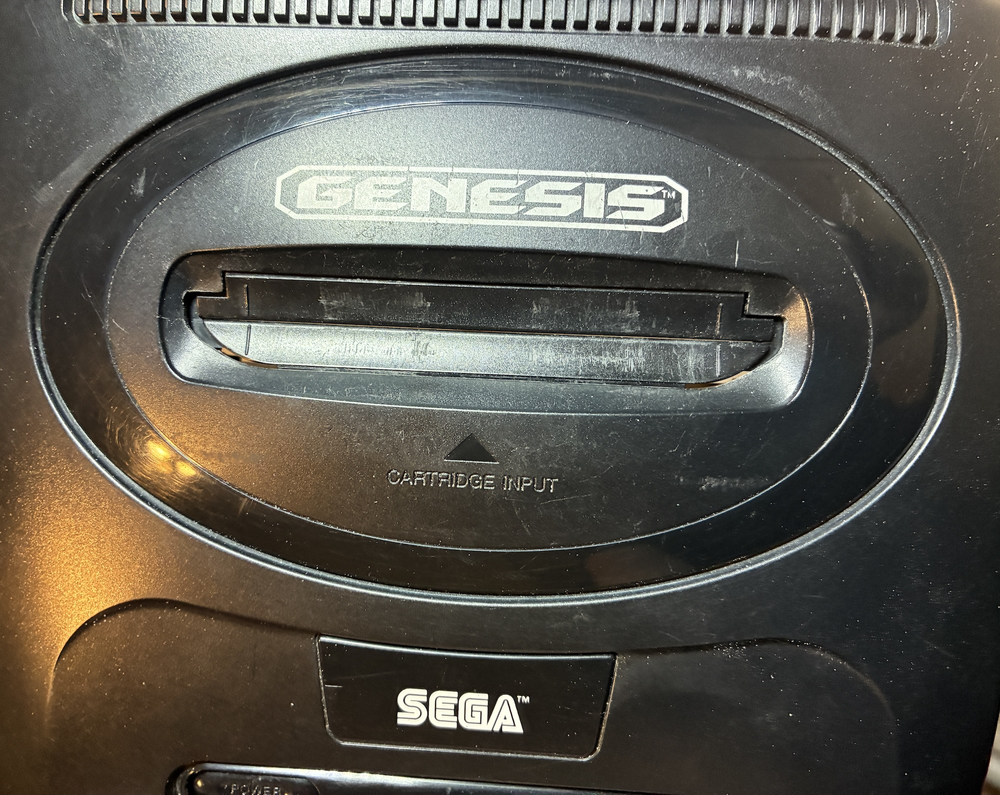
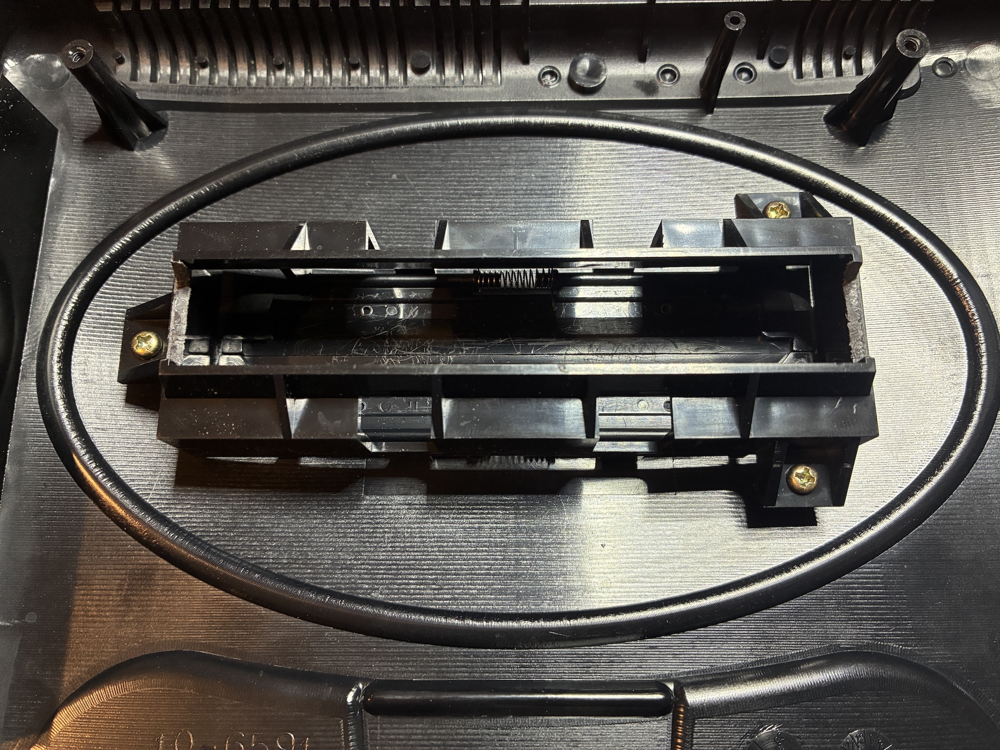

# NeptuneTrim
Picture guide on how to trim your Sega Model 2 shell to support 32x carts for the Cosam Neptune

1 - Start by placing a 32x cart on the cart slot and trace a line with something sharp so that it leaves a mark. Using a dental pic in the picture.  

 

2 - Remove the cart throat by unscrewing the 3 screws on the underside

3 - I like to scrape away some material on top to get an idea of what to file away.

4 - Using a file that is rounded on one side and flat on the other, remove material till the cart fits in the slot.

5 - On the cart slot "throat", remove only the side material on BOTH sides. This is the only part that gets in the way. I like to start by scoring the plastic, so that when using flush cutters to remove material, there are less white stress marks.

6 - This is what it looks like re-assembled. Not too bad!

